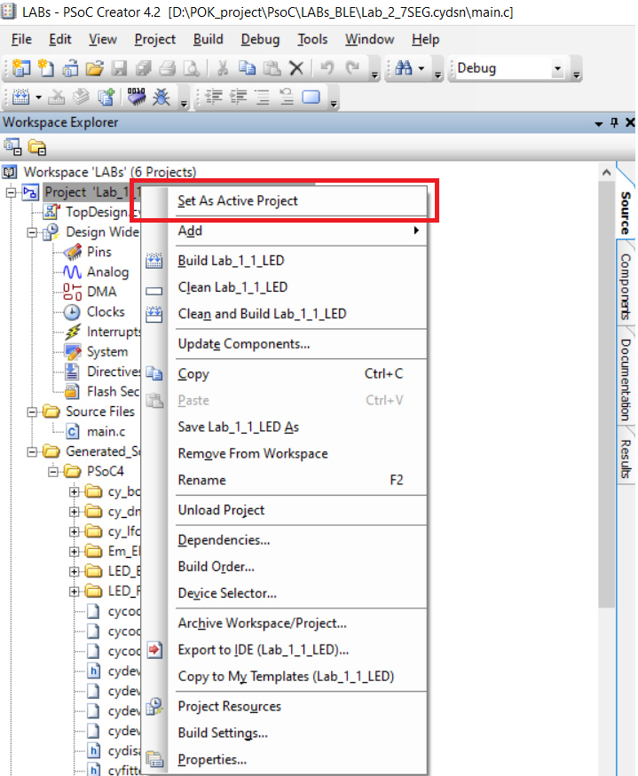
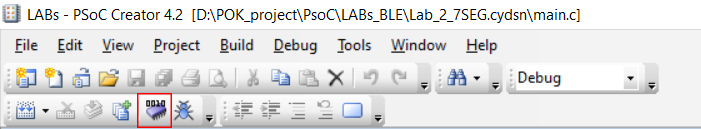
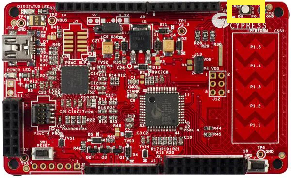
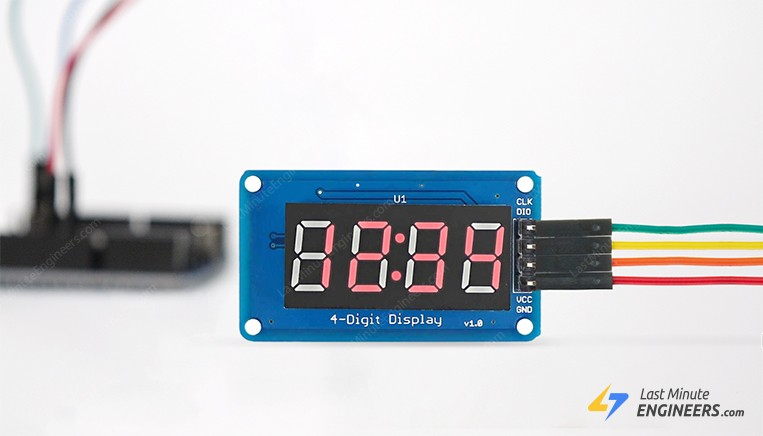
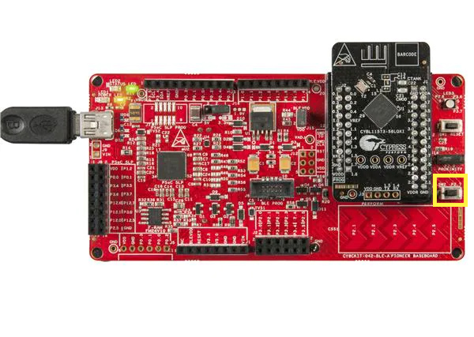
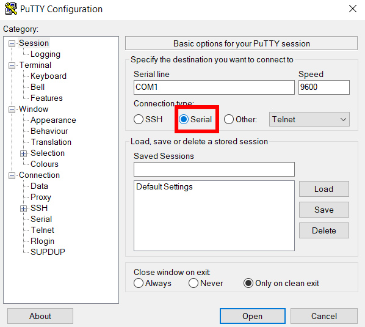
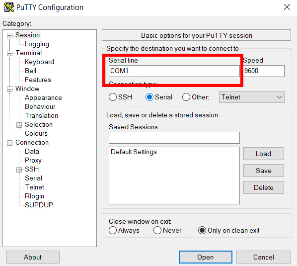
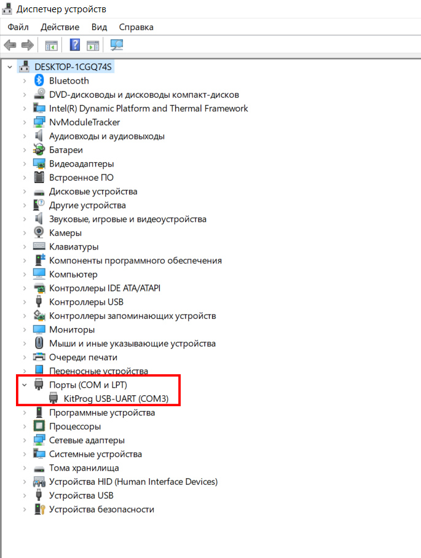
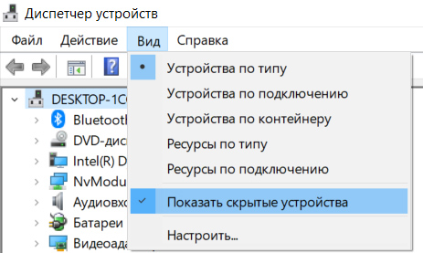

# Lab work 4: Tasks -- flashing LEDs, transmission via UART, etc.
Team: [Yakovkin Mykola](https://github.com/CaCuCkA) <br>

## Prerequisites

* PSoC CREATOR v4.2
* PuTTY
* Git


### Compilation
&nbsp;&nbsp;&nbsp;&nbsp;&nbsp;1. Open ``PSoC Creator v4.2``<br>
&nbsp;&nbsp;&nbsp;&nbsp;&nbsp;2. Open in program your project file ``LABs.cywrk`` <br>
&nbsp;&nbsp;&nbsp;&nbsp;&nbsp;3. Choose project which you want to check <br> <br>
<p align="center"></p>

&nbsp;&nbsp;&nbsp;&nbsp;&nbsp;4. Connect your PIONEER KIT to computer <br>
> **Note**
>
> If want check ``2.7``, ``3.1`` and ``3.2`` you should also connect Multi-function Shidle to your PIONEER KIT

&nbsp;&nbsp;&nbsp;&nbsp;&nbsp;4. Program your board and check the result<br> <br>
<p align="center"></p>

### Installation

#### &nbsp;&nbsp;&nbsp;&nbsp;&nbsp; PSoC CREATOR V4.2
&nbsp;&nbsp;&nbsp;&nbsp;&nbsp;&nbsp;&nbsp;&nbsp;&nbsp;&nbsp;&nbsp;&nbsp;&nbsp;&nbsp;&nbsp;1. Follow the [link](https://www.infineon.com/cms/en/design-support/tools/tools-archive/psoc-creator-archive/)<br>
&nbsp;&nbsp;&nbsp;&nbsp;&nbsp;&nbsp;&nbsp;&nbsp;&nbsp;&nbsp;&nbsp;&nbsp;&nbsp;&nbsp;&nbsp;2. Find and download file - ``PSoCCreatorSetup_4.2_es100_b641.exe``

#### &nbsp;&nbsp;&nbsp;&nbsp;&nbsp; PuTTY
&nbsp;&nbsp;&nbsp;&nbsp;&nbsp;&nbsp;&nbsp;&nbsp;&nbsp;&nbsp;&nbsp;&nbsp;&nbsp;&nbsp;&nbsp;1. Follow the [link](https://www.chiark.greenend.org.uk/~sgtatham/putty/latest.html)<br>
&nbsp;&nbsp;&nbsp;&nbsp;&nbsp;&nbsp;&nbsp;&nbsp;&nbsp;&nbsp;&nbsp;&nbsp;&nbsp;&nbsp;&nbsp;2. Select which system you want to download the app for

### Usage

1. ```1.1 - 1.3``` - Our program works with lights, so all changes must be linked to this LED<br>
    <br><p align="center"></p><br>
2. ``2.7`` - Our program works with 4 digit 7-segment LED display module.
   <br><p align="center"></p><br>

> **Note**
>&nbsp;&nbsp;&nbsp;The ``SW2`` button can be found here

<br><p align="center"></p><br>


3. ``3.1 - 3.2`` - Our program works with 4 digit 7-segment LED display module and ``PuTTY``
> **Attention!**
>How we should set up PuTTY?
> 1. Open you PuTTY and set ``Serial`` mode <br>
> <br><p align="center"></p><br><br>
> 2. Set your COM port <br>
> <br><p align="center"></p><br>
> 3. To find your COM port you should open ``Device Manager`` <br>
> <br><p align="center"></p><br>
> If you can't find it, check your settings to see if you have turned off hidden files<br>
> <br><p align="center"></p><br>

### Results

<p>During this practical exercise, we learned how to control the LED, control 
its saturation and build the flicker. We learned how to work with the 4 digit 7-segment 
LED display module and how to output negative numbers and floating point numbers. 
We learned how to use the buttons and how to communicate with our board via computer.</p>

# Additional tasks
* <b>Additional task:</b> change the brightness of the LEDs using PWM (PWM) - 2 points.
* <b>Additional task:</b> Modify the number output function to output fixed-point numbers -- 2 points.
* <b>Additional task:</b> add support for outputting floating-point numbers -- 1 point.


